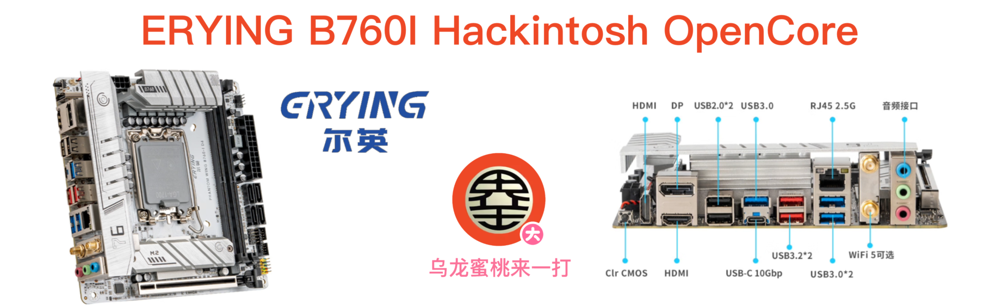

## ERYING PHANTOM WING B760-I DDR4 Hackintosh OpenCore EFI



### [简体中文](https://github.com/hackintosh-club/ERYING-B760I-OpenCore)

[OpenCore 1.0.4](https://github.com/acidanthera/OpenCorePkg)

### OS Version Tested

- macOS Monterey  12.x
- macOS Ventura     13.x 
- macOS Sonoma    14.x
- macOS Sonoma    15.x

### Hardware

- Motherboard:  B760
- Bios Version: RAP23006（2023-11-03）
- CPU: Intel 12th i5-12400
- RAM: Kingbank C18  32G（16G*2）DDR4 3600MHz
- SSD: J.ZAO KP SERIES 2TB Windows + MacOS
- iGPU: Intel UHD Graphic 770 (Only work in Windows)
- GPU: Sapphire RX580 2304 SP
- Audio: Realtek ALC897
- WiFi: Intel AX211
- Ethernet Card: Realtek RTL8125B 2.5GB
- PSU: FSP MS500 Classic 80 PLUS SBRONZE

### Notes

 - Use [OCAuxiliaryTools](https://github.com/ic005k/OCAuxiliaryTools) build your SMBIOS
 - Intel AX211 WiFi driver [AirportItlwm.kext](https://github.com/OpenIntelWireless/itlwm/releases)in this EFI is only applicable to MacOS 15 Sequoia Only. Please download and replace this driver yourself when installing other MacOS versions
 - **WiFi Need [OCLP-Mod by laobamac](https://github.com/hackintosh-club/intel-nuc10/releases/tag/oclp) Patch**
 - To use a CPU with a Efficient-core, the Kernel - ProvideCurrentCpuinfo option in the configuration file must be checked

### Bios Setup

```
Advanced
  |-- Super IO Configuraion
     |-- Serial Port 1 Configuration : Disabled
  
  |-- PowerManagement Configuration
     |-- Wake on LAN : Disabled
  
  |-- CSM Configuration
	      |-- Video：UEFI  ( need reboot )
	      |-- CSM Auto Switch : Disabled 
	      |-- CSM Support : Disabled
 
Chipset
  |-- Primary Display : Auto
  |-- VT-d : Enabled

Boot
  |-- Fast Boot : Disabled

Security
  |-- Secure Boot Mode  : Disabled
       

```

### Contact Us

QQ Group: 23304408


### Tools

- [Hackintool](https://github.com/headkaze/Hackintool) 
- [OCAuxiliaryTools](https://github.com/ic005k/OCAuxiliaryTools) AKA `OCAT`.
- [OpenCore Configurator](https://mackie100projects.altervista.org/opencore-configurator/) AKA `OCC`.
- [gibMacOS](https://github.com/corpnewt/gibMacOS) Build your own MacOS image.
- [ProperTree](https://github.com/corpnewt/ProperTree) Plist editor.
